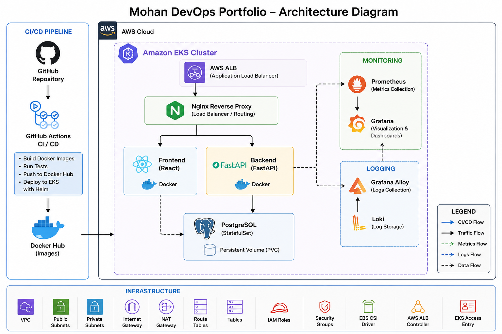
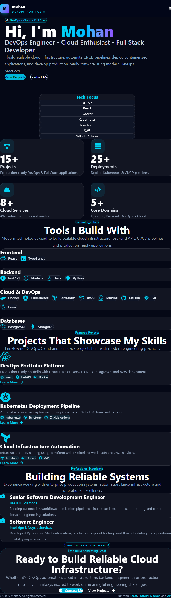
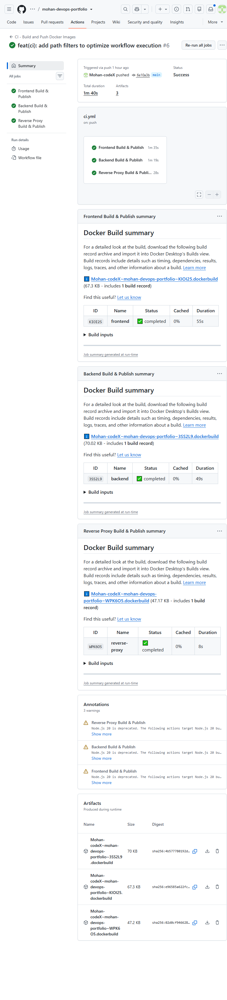
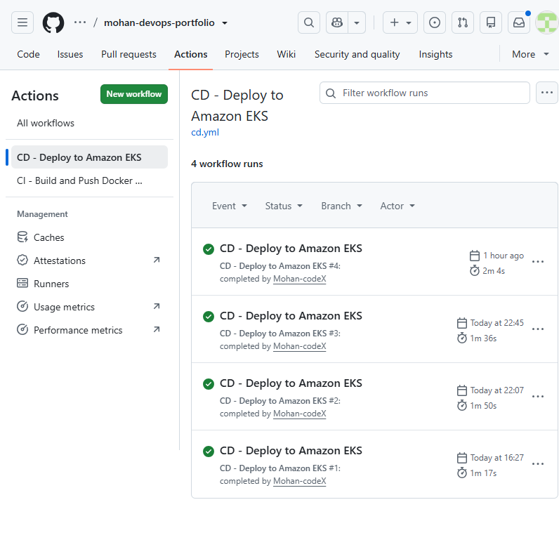
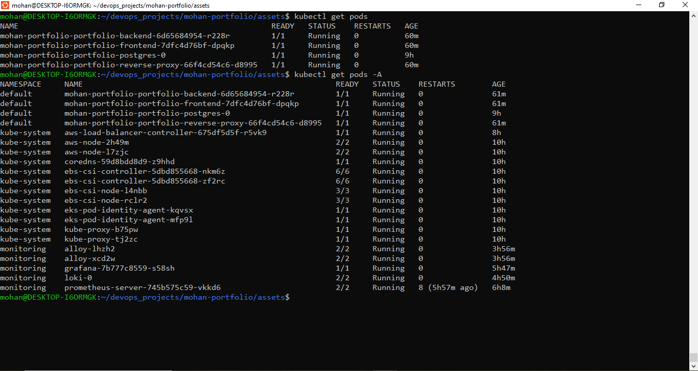
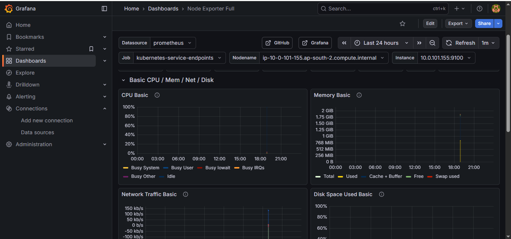
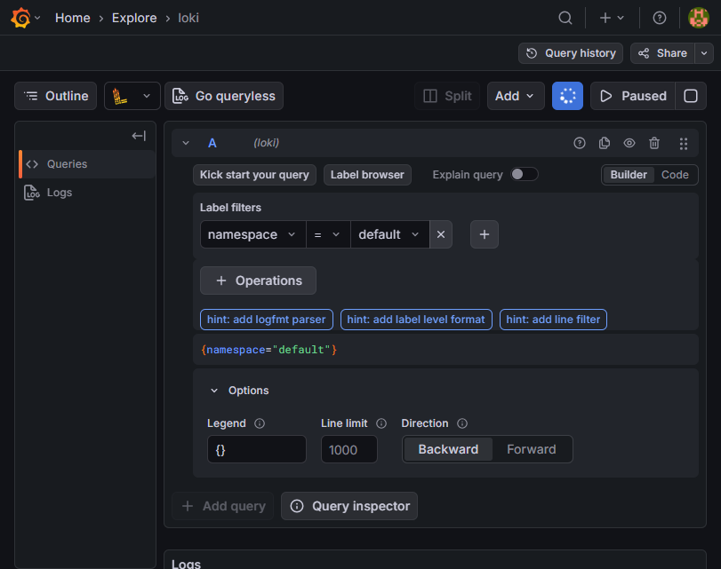

# 🚀 Mohan DevOps Portfolio

> A production-oriented full-stack application demonstrating modern DevOps practices using FastAPI, React, PostgreSQL, Docker, Kubernetes, Helm, Terraform, AWS EKS, GitHub Actions, Prometheus, Grafana, Loki, and Grafana Alloy.

---

# Project Overview

This project showcases an end-to-end DevOps workflow, from application development to automated deployment and observability on AWS.

It demonstrates:

* Infrastructure as Code using Terraform
* Containerized applications using Docker
* Kubernetes orchestration on Amazon EKS
* Helm-based application deployment
* CI/CD using GitHub Actions
* Application monitoring with Prometheus and Grafana
* Centralized logging using Loki and Grafana Alloy
* AWS Application Load Balancer integration
* Production-oriented deployment practices

---

# Tech Stack

## Backend

* FastAPI
* SQLAlchemy
* Alembic
* PostgreSQL
* JWT Authentication

## Frontend

* React
* TypeScript
* Vite

## Infrastructure

* Docker
* Docker Compose
* Kubernetes
* Helm
* Terraform
* AWS EKS
* AWS ALB Controller
* AWS EBS CSI Driver

## CI/CD

* GitHub Actions
* Docker Hub

## Monitoring & Logging

* Prometheus
* Grafana
* Loki
* Grafana Alloy

---

# Repository Structure

```text
backend/
frontend/
reverse-proxy/
helm/
infrastructure/
monitoring/
logging/
docker/
scripts/
docs/
assets/
```

---

# Architecture

<p align="center">
  
</p>

---

# Screenshots

## Portfolio Home



## GitHub Actions - CI Pipeline



## GitHub Actions - CD Pipeline



## Amazon EKS Workloads



## Grafana Dashboard



## Loki Log Explorer



---

# Infrastructure

Terraform provisions:

* VPC
* Public Subnets
* Private Subnets
* Internet Gateway
* NAT Gateway
* Route Tables
* Security Groups
* IAM Roles
* Amazon EKS Cluster
* Managed Node Group
* EKS Access Entries

---

# Kubernetes

Application components:

* Frontend Deployment
* Backend Deployment
* PostgreSQL StatefulSet
* Reverse Proxy Deployment
* Services
* ConfigMaps
* Secrets
* Persistent Volume Claim
* Ingress

Deployment is managed using Helm.

---

# CI Pipeline

GitHub Actions automatically:

* Builds frontend image
* Builds backend image
* Builds reverse proxy image
* Pushes versioned images to Docker Hub

---

# CD Pipeline

Successful CI automatically triggers deployment.

Deployment process:

1. Authenticate to AWS
2. Configure kubectl
3. Configure Helm
4. Connect to Amazon EKS
5. Deploy using Helm
6. Use immutable image tags
7. Verify rollout

---

# Monitoring

Prometheus collects Kubernetes and application metrics.

Grafana provides dashboards for:

* Cluster health
* Resource usage
* Application metrics

---

# Logging

Logging pipeline:

```text
Application Logs
        │
        ▼
Grafana Alloy
        │
        ▼
Loki
        │
        ▼
Grafana
```

Logs include:

* Backend
* Nginx
* Reverse Proxy
* Kubernetes
* SQLAlchemy

---

# Local Development

Clone repository

```bash
git clone https://github.com/Mohan-codeX/mohan-devops-portfolio.git
cd mohan-devops-portfolio
```

Start locally

```bash
docker compose up --build
```

---

# Deployment Workflow

```text
Developer
    │
    ▼
Git Push
    │
    ▼
GitHub Actions CI
    │
    ▼
Docker Hub
    │
    ▼
GitHub Actions CD
    │
    ▼
Helm Upgrade
    │
    ▼
Amazon EKS
```

---

# Health Check

Backend health endpoint:

```text
GET /health
```

Used by Kubernetes probes.

---

# Features

* Production-ready FastAPI backend
* React frontend
* PostgreSQL database
* Dockerized services
* Kubernetes deployment
* Helm packaging
* Infrastructure as Code
* Automated CI/CD
* AWS EKS deployment
* ALB Ingress
* Centralized logging
* Metrics and dashboards

---

# Future Improvements

* Horizontal Pod Autoscaler
* Multi-environment Helm values
* Secret Manager integration
* Canary deployments
* Blue/Green deployments

---

# License

This project is released under the MIT License.

---

# Author

**Mohan**

GitHub: https://github.com/Mohan-codeX
